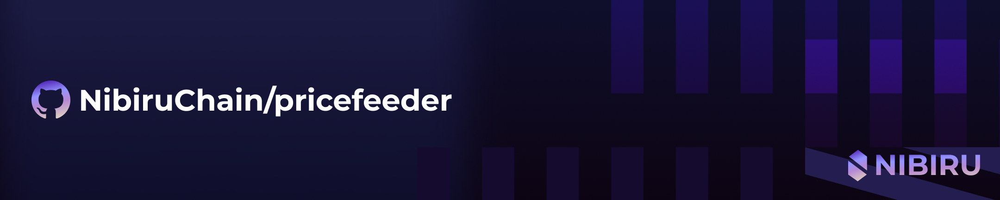

# NibiruChain/pricefeeder for the Oracle Module



The `pricefeeder` is a tool developed for Nibiru's [Oracle Module consensus](https://nibiru.fi/docs/ecosystem/oracle/) that runs a process to pull data from various external sources and then broadcasts transactions to vote on exchange rates.

- [NibiruChain/pricefeeder for the Oracle Module](#nibiruchainpricefeeder-for-the-oracle-module)
  - [Quick Start - Local Development](#quick-start---local-development)
    - [Configuration for the `.env`](#configuration-for-the-env)
    - [Run](#run)
      - [Or, to run the tool as a daemon](#or-to-run-the-tool-as-a-daemon)
  - [Hacking](#hacking)
    - [Build](#build)
    - [Delegating "feeder" consent](#delegating-feeder-consent)
    - [Enabling TLS](#enabling-tls)
    - [Configuring specific exchanges](#configuring-specific-exchanges)
      - [CoinGecko](#coingecko)
  - [Glossary](#glossary)

## Quick Start - Local Development

### Configuration for the `.env`

Running a `feeder` requires the setting environment variables in your `.env` in like the following:

```ini
CHAIN_ID="nibiru-localnet-0"
GRPC_ENDPOINT="localhost:9090"
WEBSOCKET_ENDPOINT="ws://localhost:26657/websocket"
FEEDER_MNEMONIC="guard cream sadness conduct invite crumble clock pudding hole grit liar hotel maid produce squeeze return argue turtle know drive eight casino maze host"
EXCHANGE_SYMBOLS_MAP='{"bitfinex": {"ubtc:unusd": "tBTCUSD", "ueth:unusd": "tETHUSD", "uusd:unusd": "tUSTUSD"}}'
```

This would allow you to run `pricefeeder` using a local instance of the network. To set up a local network, you can run:

```bash
git clone git@github.com:NibiruChain/nibiru.git
cd nibiru
git checkout v0.19.2
make localnet
```

### Run

With your environment set to a live network, you can now run the price feeder:

```sh
make run
```

#### Or, to run the tool as a daemon

1. Build a docker image for use with docker compose.

    ```bash
    make build-docker
    ```

2. Run the 'price_feeder' service defined in the `docker-compose.yaml`.

    ```bash
    make docker-compose up -d price_feeder
    ```

## Hacking

Connecters for data sources like Binance and Bitfinex are defined in the `feeder/priceprovider/sources` directory. Each of these sources must implement a `FetchPricesFunc` function for querying external data.

### Build

Builds the binary for the package:

```sh
make build
```

### Delegating "feeder" consent

Votes for exhange rates in the [Oracle Module](https://nibiru.fi/docs/ecosystem/oracle/) are posted by validator nodes, however a validator can give consent a `feeder` account to post prices on its behalf. This way, the validator won't have to use their validator's mnemonic to send transactions.  

In order to be able to delegate consent to post prices, you need to set the
`VALIDATOR_ADDRESS` env variable to the "valoper" address the `feeder` will represent.

```ini
VALIDATOR_ADDRESS="nibivaloper1..."
```

To delegate consent from a validator node to some `feeder` address, you must execute a `MsgDelegateFeedConsent` message:

```go
type MsgDelegateFeedConsent struct {
 Operator string 
 Delegate string
}
```

This is possible using the `set-feeder` subcommand of the `nibid` CLI:

```bash
nibid tx oracle set-feeder [feeder-address] --from validator
```

### Enabling TLS

To enable TLS, you need to set the following env vars:

```ini
TLS_ENABLED="true"
```

### Configuring specific exchanges

#### CoinGecko

Coingecko source allows to use paid api key to get more requests per minute. In order to configure it,
you need to set env var:

```ini
DATASOURCE_CONFIG_MAP='{"coingecko": {"api_key": "0123456789"}}'
```

## Glossary

- **Data source**: A data source is an external service that provides data. For example, Binance is a data source that provides the price of various assets.
- **Symbol**: A symbol is a string that represents a pair of assets on an external data source. For example, `tBTCUSD` is a symbol on Bitfinex that represents the price of Bitcoin in US Dollars.
- **Ticker**: Synonymous with **Symbol**. Exchanges generally use the term "ticker" to refer to a symbol.
- **Pair**: A pair is a combination of two assets recognized by Nibiru Chain. For example, `ubtc:uusd` is a pair that represents Bitcoin and USD.
